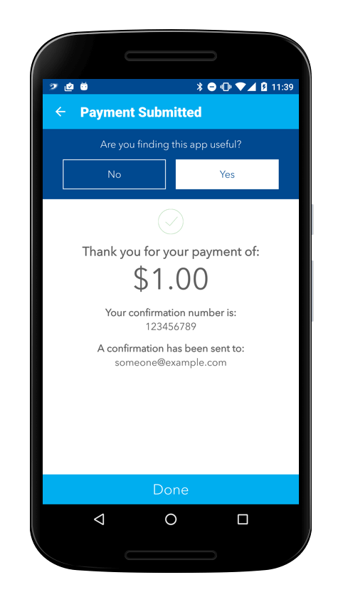
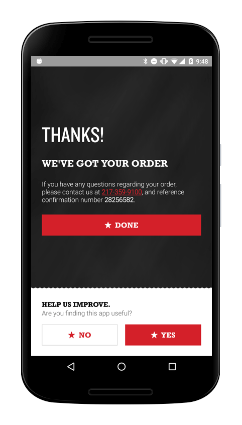

# amplify

Respectfully request feedback in your Android app.

<a href="https://travis-ci.org/stkent/amplify"></a> <a href="https://bintray.com/stkent/android-libraries/amplify/"></a> <a href="http://www.detroitlabs.com/"></a>

# Table Of Contents

- [Introduction](#introduction)
- [Library Structure](#library-structure)
- [Getting Started](#getting-started)
    - [Default Behavior](#default-behavior)
- [Configuring](#configuring)
- [Customizing](#customizing)
- [Case Studies](#case-studies)
- [License](#license)

# Introduction

_amplify_ focuses on helping Android developers prompt their users for feedback at the right times and in the right way. Inspired by [Circa News](https://medium.com/circa/the-right-way-to-ask-users-to-review-your-app-9a32fd604fca), we built this library based on the following principles: 

- **No interruptions.** The inline prompt we provide can be inserted right into your view hierarchy and customized to complement your existing UI. Users are free to interact with the prompt as much or as little as they like. This approach shows respect for your users and preserves the app flow you have carefully crafted.

- **No nagging.** _amplify_ intelligently tracks significant events to make sure your users are only prompted for feedback at appropriate times.

- **Maximum impact.** When users indicate they are willing to provide feedback, we direct them to the highest-impact outlet:

    - Users with positive feedback are asked to leave a quick rating or review in the Google Play Store, improving the rating and discoverability of your app. All of these ratings and reviews reflect genuine user experiences - _amplify_ just makes it easier for happy customers to choose to share their appreciation.

    - Users with critical feedback are instead asked to send a more detailed email that will automatically include pertinent app and device information. This gives you an opportunity to engage these users in a more meaningful dialogue, allowing you to better understand and accommodate their feedback.

- **Easy to integrate.** Default prompt timing rules allow you to get up and running as quickly as possible.

- **Easy to customize.** Use both built-in and custom events to create a collection of prompt timing rules. Tweak the provided inline prompt UI via xml or in code.

# Library Structure

_amplify_ consists of two main components:

- A **prompt timing calculator**, represented by the `Amplify` class, responsible for:

    - verifying that the current device provides the required feedback channels (the Google Play Store + at least one email application);

    - tracking occurrences of significant events and evaluating rules based on these events to determine appropriate times to ask for feedback (we occasionally refer to this portion of the library as the **event-tracking engine**);

- A custom **inline feedback prompt**, represented by the `PromptView` class, that guides users through the flow depicted below to determine the appropriate outlet for their feedback:

<br />

<p align="center">
	
</p>

<br />

These components are designed to complement each other, and combining them as described in the [Getting Started](#getting-started) section below is the easiest way to integrate _amplify_ into your application. However, it is perfectly possible to couple the prompt timing calculator with your own prompt flow and UI if desired. (This could be useful if you have highly-customized requirements for the prompt flow.) If you pursue this route, we would encourage you to ensure your prompting mechanism still reflects the principles outlined in the [Introduction](#introduction).

# Getting Started

<ol>
  <li>Specify <em>amplify</em> as a dependency in your <code>build.gradle</code> file:</li>
</ol>

```groovy
dependencies {
    compile 'com.github.stkent:amplify:{latest-version}'
}
```

<ol start="2">
  <li>Initialize the shared <code>Amplify</code> instance in your custom <code><a href="http://developer.android.com/reference/android/app/Application.html">Application</a></code> subclass:</li>
</ol>

```java
public class ExampleApplication extends Application {
    
    @Override
    public void onCreate() {
        super.onCreate();
        
        Amplify.get(this)
               .setFeedbackEmailAddress("someone@example.com")
               .applyAllDefaultRules();
    }
    
}
```

<ol start="3">
  <li>Add a <code>DefaultLayoutPromptView</code> instance to all xml layouts in which you may want to prompt the user for their feedback:</li>
</ol>

```xml
<com.github.stkent.amplify.prompt.DefaultLayoutPromptView
    android:id="@+id/prompt_view"
    android:layout_width="match_parent"
    android:layout_height="wrap_content" />
```

<ol start="4">
  <li>Call the state tracker's <code>promptIfReady</code> method when appropriate, passing in the current <code>Activity</code> and your <code>DefaultLayoutPromptView</code> instance:</li>
</ol>

```java
DefaultLayoutPromptView promptView = (DefaultLayoutPromptView) findViewById(R.id.prompt_view);
Amplify.get(context).promptIfReady(activity, promptView);
```

That's it! The prompt timing calculator will evaluate the default rules each time `promptIfReady` is called, and instruct the `PromptView` to automatically update its visibility based on the result. If the user chooses to interact with the prompt, the sequence of questions asked is also automatically managed by the `PromptView`. If the user decides to give feedback, _amplify_ will automatically handle opening the appropriate Google Play Store page or email client with prepopulated details.

## Default Behavior

The convenience method `applyAllDefaultRules` initializes the prompt timing calculator with a collection of sensible default rules. With these rules applied, we only prompt for feedback when:

- **The Google Play Store is available.** If a user's device won't allow them to provide feedback, we never ask for it. (We believe that a high enough percentage of devices are capable of sending email that a similar check for the availability of an email application is unnecessary.)

- **It has been more than a week since a new version of your app was installed.** We like to give users some time to settle in and explore the changes made in the latest update before asking them their opinion... but not so much time that their valuable first impressions are forgotten!

- **It has been more than a week since your app last crashed.** There are much better ways to collect detailed crash information than via user feedback. We're big fans of [Fabric/Crashlytics](https://fabric.io/kits/android/crashlytics). To save users from spending time reporting crashes that we are already aware of and fixing, we avoid asking for feedback right after a crash has occurred.

- **The user has never previously provided positive feedback.** We strive to constantly improve our apps' functionality and stability. If we do our job right, there's little to be gained by prompting satisfied users for feedback repeatedly. If we decide to significantly overhaul our app (either internally or externally), we will reset the prompt timing calculator to capture feedback from our entire userbase again. // TODO: link to a section that explains how to do this.

- **The user has not provided critical feedback for this version of the application already.** Since it's unlikely that we'll be able to address any critical feedback received without releasing an update, we won't re-prompt a user who already provided insights into the current version of the app.

- **The user has not actively declined to provide feedback for this version of the application.** If a user has already actively indicated they are not interested in providing feedback for the current version of the app, we won't ask again before the next update is shipped. (Note that 'actively indicated' here means a user deliberately declined to provide feedback. This rule does not apply to users who have seen but did not interact with the prompt in any way.)

More information on how to apply your own collection of rules is available in the [Configuring](#configuring) section. Building custom rules is covered in the [Customizing](#customizing) section.

# Configuring

## Rules

_amplify_ calculates prompt timing based on two types of rule.

### Environment-based Rules

These rules are based on the environment/device in which the embedding application is currently running. For example, they may query whether or not the current device is capable of handling a specific [`Intent`](http://developer.android.com/reference/android/content/Intent.html).

_amplify_ is packaged with the following environment-based rules:

- `GooglePlayStoreRule`: verifies whether or not the Google Play Store is installed on the current device.

Environment-based rules can be applied by calling the `addEnvironmentBasedRule` method when configuring your `Amplify` instance. For example:

```java
public class ExampleApplication extends Application {
    
    @Override
    public void onCreate() {
        super.onCreate();
        
        Amplify.get(this)
               .setFeedbackEmailAddress("someone@example.com")
               .addEnvironmentBasedRule(new GooglePlayStoreRule()); // Prompt never shown if Google Play Store not installed.
    }
    
}
```

### Event-based Rules

These rules are based on tracked events that occur within the embedding application. Different dimensions of these events can be tracked (time of first/most recent occurrence, total number of occurrences, etc.)

The **times** of the following special events are automatically tracked whenever _amplify_ is enabled:

- original app install (note: this can pre-date the time at which _amplify_ was added to your application!);
- last app update time;
- last app crash time;

Rules related to each of these events can be configured using the dedicated configuration methods `setInstallTimeCooldownDays`, `setLastUpdateTimeCooldownDays`, and `setLastCrashTimeCooldownDays`. For example:

```java
public class ExampleApplication extends Application {
    
    @Override
    public void onCreate() {
        super.onCreate();
        
        Amplify.get(this)
               .setFeedbackEmailAddress("someone@example.com")
               .setInstallTimeCooldownDays(14) // Prompt not shown within two weeks of initial install.
               .setLastUpdateTimeCooldownDays(7) // Prompt not shown within one week of most recent update.
               .setLastCrashTimeCooldownDays(7); // Prompt not shown within one week of most recent crash.
    }
    
}
```

The following events are also automatically reported to the shared `Amplify` instance whenever you use one of the `promptIfReady` methods to show your prompt:

- prompt was shown;
- user indicated a positive opinion of the app;
- user indicated a critical opinion of the app;
- user agreed to give feedback (either positive or critical);
- user declined to give feedback (either positive or critical);
- user agreed to give positive feedback;
- user agreed to give critical feedback;
- user declined to give positive feedback;
- user declined to give critical feedback;
- thanks view was shown;
- prompt was auto-dismissed.

To apply rules based on these events, use the configuration methods `addTotalEventCountRule`, `addFirstEventTimeRule`, `addLastEventTimeRule`, `addLastEventVersionRule`. The method you select will determine which dimension of the event is tracked using `SharedPreferences`. Each method accepts two parameters:

- the event to be tracked; in this case, one of the events defined in the `PromptViewEvent` enum;
- the event-based rule to be applied to that tracked dimension.

_amplify_ is packaged with the following event-based rules:

- `CooldownDaysRule`: checks whether enough time has elapsed since the last occurrence of this event.
- `MaximumCountRule`: checks whether this event has occurred enough times.
- `VersionChangedRule`: checks whether this event has occurred for the current version of the embedding application.
- `WarmupDaysRule`: checks whether enough time has elapsed since the first occurrence of this event.

An example configuration that leverage these rules is below:

TODO: add a few more example rules to this snippet!

```java
public class ExampleApplication extends Application {
    
    @Override
    public void onCreate() {
        super.onCreate();
        
        Amplify.get(this)
               .setFeedbackEmailAddress("someone@example.com")
               .addTotalEventCountRule(PromptViewEvent.USER_GAVE_POSITIVE_FEEDBACK,
                        new MaximumCountRule(1)) // Never ask the user for feedback again if they already responded positively.
    }
    
}
```                

## Prompt UI

_amplify_ provides two configurable prompt UIs.

### Default Layout

**Use this if you are happy with the basic layout of the prompt shown above, but need to customize colors or wording!**

Provided by the `DefaultLayoutPromptView` class. The basic layouts of the questions and thanks presented to users of the embedding application are fixed, but the most important elements of those layouts (colors and text) are fully customizable. The full set of available xml configuration hooks is shown below (remember to use the `app` xml namespace when setting these properties!):

    <com.github.stkent.amplify.prompt.DefaultLayoutPromptView
        android:id="@+id/prompt_view"
        android:layout_width="match_parent"
        android:layout_height="wrap_content"
        app:prompt_view_user_opinion_question_title="Custom Title String"
        app:prompt_view_user_opinion_question_subtitle="Custom Subtitle String"
        app:prompt_view_user_opinion_question_positive_button_label="Custom Button Title String"
        app:prompt_view_user_opinion_question_negative_button_label="Custom Button Title String"
        app:prompt_view_positive_feedback_question_title="Custom Title String"
        app:prompt_view_positive_feedback_question_subtitle="Custom Subtitle String"
        app:prompt_view_positive_feedback_question_positive_button_label="Custom Button Title String"
        app:prompt_view_positive_feedback_question_negative_button_label="Custom Button Title String"
        app:prompt_view_critical_feedback_question_title="Custom Title String"
        app:prompt_view_critical_feedback_question_subtitle="Custom Subtitle String".
        app:prompt_view_critical_feedback_question_positive_button_label="Custom Button Title String"
        app:prompt_view_critical_feedback_question_negative_button_label="Custom Button Title String"
        app:prompt_view_thanks_title="Custom Title String"
        app:prompt_view_thanks_subtitle="Custom Subtitle String"
        app:prompt_view_foreground_color="@color/custom_foreground_color"
        app:prompt_view_background_color="@color/custom_background_color"
        app:prompt_view_title_text_color="@color/custom_title_text_color"
        app:prompt_view_subtitle_text_color="@color/custom_subtitle_text_color"
        app:prompt_view_positive_button_text_color="@color/custom_positive_button_text_color"
        app:prompt_view_positive_button_background_color="@color/custom_positive_button_background_color"
        app:prompt_view_positive_button_border_color="@color/custom_positive_button_border_color"
        app:prompt_view_negative_button_text_color="@color/custom_negative_button_text_color"
        app:prompt_view_negative_button_background_color="@color/custom_negative_button_background_color"
        app:prompt_view_negative_button_border_color="@color/custom_negative_button_border_color" />

All attributes are optional.

TODO: show some screenshots of examples created using this method?

### Custom Layout

**Use this if you need to provide a structurally different prompt layout, require custom fonts, etc.**

Provided by the `CustomLayoutPromptView` class. You provide the basic layouts to use, and any customization of the default strings you require. The full set of available xml configuration hooks is shown below (remember to use the `app` xml namespace when setting these properties!):

    <com.github.stkent.amplify.prompt.DefaultLayoutPromptView
        android:id="@+id/prompt_view"
        android:layout_width="match_parent"
        android:layout_height="wrap_content"
        app:prompt_view_question_layout="@layout/include_amplify_question_layout"
        app:prompt_view_thanks_layout="@layout/include_amplify_question_layout"
        app:prompt_view_user_opinion_question_title="Custom Title String"
        app:prompt_view_user_opinion_question_subtitle="Custom Subtitle String"
        app:prompt_view_user_opinion_question_positive_button_label="Custom Button Title String"
        app:prompt_view_user_opinion_question_negative_button_label="Custom Button Title String"
        app:prompt_view_positive_feedback_question_title="Custom Title String"
        app:prompt_view_positive_feedback_question_subtitle="Custom Subtitle String"
        app:prompt_view_positive_feedback_question_positive_button_label="Custom Button Title String"
        app:prompt_view_positive_feedback_question_negative_button_label="Custom Button Title String"
        app:prompt_view_critical_feedback_question_title="Custom Title String"
        app:prompt_view_critical_feedback_question_subtitle="Custom Subtitle String"
        app:prompt_view_critical_feedback_question_positive_button_label="Custom Button Title String"
        app:prompt_view_critical_feedback_question_negative_button_label="Custom Button Title String"
        app:prompt_view_thanks_title="Custom Title String"
        app:prompt_view_thanks_subtitle="Custom Subtitle String" />

The `prompt_view_question_layout` attribute is **required** and subject to some additional requirements (listed below). All other attributes are optional. If `prompt_view_thanks_layout` is not provided, the prompt will automatically dismiss at the end of every flow. If it is provided, the user will see the thanks view whenever they agree to give feedback.

#### Included Question Layout Requirements

The layout referenced by `prompt_view_question_layout` _must_ include:

- A `TextView` subclass with id `amplify_title_text_view`;
- A `TextView` subclass with id `amplify_positive_button`;
- A `TextView` subclass with id `amplify_negative_button`.

If a view is found with an appropriate button id but it is _not_ a `TextView` subclass, the library will gracefully no-op when trying to set the button text.

The layout referenced by `prompt_view_question_layout` _may_ include:

   - A `TextView` subclass with id `amplify_subtitle_text_view`;
 
#### Included Thanks Layout Requirements 

The layout referenced by `prompt_view_thanks_layout ` _must_ include:

- A `TextView` subclass with id `amplify_title_text_view`.

The layout referenced by `prompt_view_thanks_layout ` _may_ include:

- A `TextView` subclass with id `amplify_subtitle_text_view`.

TODO: show some screenshots of examples created using this method?

### Listening For `IPromptView` Events

It may sometimes be useful to know when the state of the `IPromptView` subclass you are using changes. For example, you may want to:

- track user interactions with the prompt view using your preferred analytics suite;
- adjust other UI elements when the prompt view is shown/hidden.

To allow this, the `promptIfReady` method optionally accepts an `IEventListener<PromptViewEvent>` parameter that will receive notifications of all tracked `PromptViewEvents`. An example implementation demonstrating these use-cases is given below:

    Amplify.get(this).promptIfReady(this, promptView, new IEventListener<PromptViewEvent>() {
        @Override
        public void notifyEventTriggered(@NonNull final PromptViewEvent event) {
            AnalyticsTracker.notifyOfEvent(event);
        
            if (event == PROMPT_SHOWN) {
                relatedView.setVisibility(VISIBLE);
            } else if (event == PROMPT_DISMISSED) {
                relatedView.setVisibility(GONE);
            }
        }
    });

## Debug Settings

The delayed nature of _amplify_ prompts can make it hard to test effectively when integrated. We provide the following debug configuration methods to help with this:

- `setLogLevel(@NonNull final Logger.LogLevel logLevel)`: set verbosity of library logging. Options are: `NONE`, `ERROR`, and `DEBUG`. We recommend disabling logging in production builds using the `BuildConfig` class generated by the embedding application. For example:

```java
public class ExampleApplication extends Application {
    
    @Override
    public void onCreate() {
        super.onCreate();
        
        Amplify.get(this)
               .setFeedbackEmailAddress("someone@example.com")
               .setLogLevel(BuildConfig.DEBUG ? Logger.LogLevel.DEBUG : Logger.LogLevel.NONE);
    }
    
}
```

- `setAlwaysShow(final boolean alwaysShow)`: if `alwaysShow` is true, this forces the prompt to show every time. This is useful while tweaking prompt UI. Example usage in debug builds only:

```java
public class ExampleApplication extends Application {
    
    @Override
    public void onCreate() {
        super.onCreate();
        
        Amplify.get(this)
               .setFeedbackEmailAddress("someone@example.com")
               .setAlwaysShow(BuildConfig.DEBUG);
    }
    
}
```

- `setPackageName(@NonNull final String packageName)`: if your debug and release build types do not share a package name (perhaps to allow for both build types to be installed simultaneously), the library will fail to load the appropriate Google Play Store page in debug builds. To counter this, pass your release build package name to this method during configuration. For example:

```java
public class ExampleApplication extends Application {
    
    @Override
    public void onCreate() {
        super.onCreate();
        
        Amplify.get(this)
               .setFeedbackEmailAddress("someone@example.com")
               .setPackageName("my.release.package.name");
    }
    
}
```

# Customizing

## Rules

### Applying Custom Environment-based Rules

A new custom environment-based rule can be added by implementing the `IEnvironmentBasedRule` interface and passing an instance of this implementation to the `Amplify` instance method `addEnvironmentBasedRule`:

```java
public class ExampleApplication extends Application {
    
    @Override
    public void onCreate() {
        super.onCreate();
        
        Amplify.get(this)
               .setFeedbackEmailAddress("someone@example.com")
               .addEnvironmentBasedRule(new MyCustomEnvironmentBasedRule());
    }
    
}
```

### Tracking Custom Events

A new custom event can be tracked by implementing the `IEvent` interface, registering this event with a corresponding (default or custom) `IEventBasedRule` using one of the following methods:

- `addTotalEventCountRule`;
- `addFirstEventTimeRule`;
- `addLastEventTimeRule`;
- `addLastEventVersionRule`,

and then notifying the `Amplify` instance of occurrences of this event using the `notifyEventTriggered` method:

    Amplify.get(this).notifyEventTriggered(new MyCustomEvent());
    
As before, the dimension of the event that will be tracked is dictated by which registration method is called.

### Applying Custom Event-based Rules

A new custom event can be tracked by implementing the `IEventBasedRule<T>` interface, and registering a (default or custom) `IEvent` with this custom `IEventBasedRule` using one of the following methods:

- `addTotalEventCountRule`;
- `addFirstEventTimeRule`;
- `addLastEventTimeRule`;
- `addLastEventVersionRule`.

The generic type `T` must be one of: `Integer`, `Long`, or `String`. The type you select will depend on which tracked event aspect (time, count, etc.) you wish to apply this check to.

## Prompt UI

To provide fully-custom views for each phase of the typical prompt flow, implement the `IPromptView` interface and pass an instance of this implementation to one of the `promptIfReady` methods. You should save the presenter injected into your custom class via the `setPresenter` method, and communicate user-driven events to the presenter within your custom view. See the `BasePromptView` for a sample implementation in which all questions are assumed to share a common view structure.

To provide a totally custom experience in which _amplify_ does not manage the prompt/rating/feedback UI flows at all, replace any calls to `promptIfReady` with calls to `shouldPrompt`. This method will evaluate all rules and provide a boolean that indicates whether every provided rule is currently satisfied. You may then use this hook to begin your own feedback request flow.

# Case Studies

Early versions of _amplify_ are integrated in apps with state-wide and nation-wide audiences, with over 200,000 installs combined. After integrating _amplify_, our data indicates that the number of Play Store reviews received increases by a factor of **5x-10x**, and the number of feedback emails received **doubles**. We present screenshots showing example implementations below:

| Styled default layout | Custom layout         |
|-----------------------|-----------------------|
|    |   |

# License

    Copyright 2015 Stuart Kent
    
    Licensed under the Apache License, Version 2.0 (the "License");
    you may not use this file except in compliance with the License.
    You may obtain a copy of the License at
    
       http://www.apache.org/licenses/LICENSE-2.0
    
    Unless required by applicable law or agreed to in writing, software
    distributed under the License is distributed on an "AS IS" BASIS,
    WITHOUT WARRANTIES OR CONDITIONS OF ANY KIND, either express or implied.
    See the License for the specific language governing permissions and
    limitations under the License.
